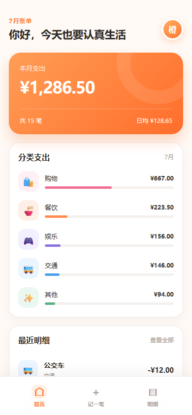
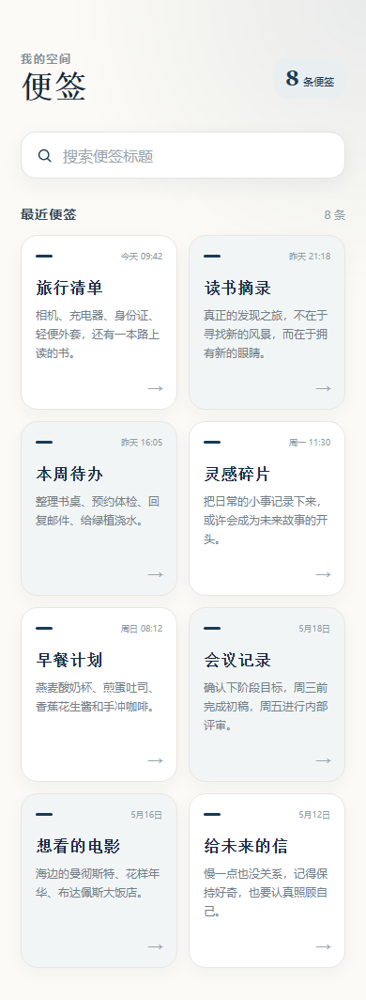
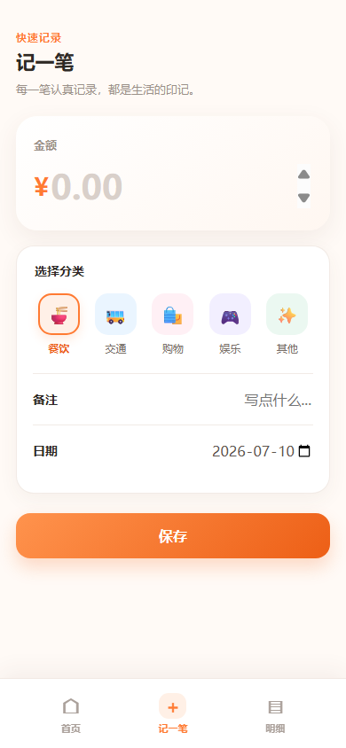
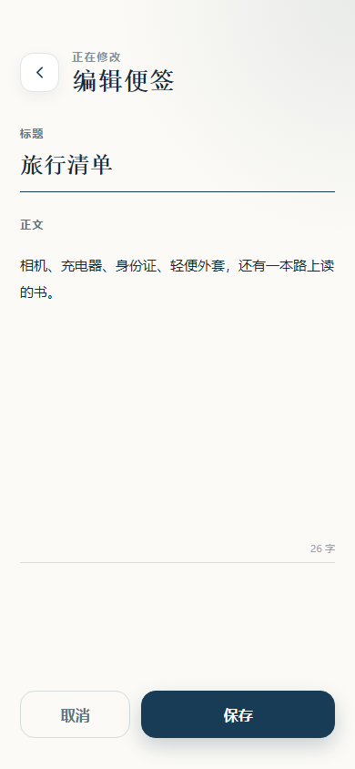

# Vibe-one

[](https://github.com/Aschenbath/Vibe-one/actions/workflows/ci.yml)

Bounded AI delivery pipeline: takes a product brief, generates a spec and a runnable React app, verifies it with real local commands and Playwright scenarios, repairs failures within a bounded loop, and emits an auditable delivery report.

```text
brief.md -> SPEC.generated.md -> generated app -> build + preview + screenshots -> repair loop -> DELIVERY_REPORT.md
```

See `FRAMEWORK.md` for the product boundary and `docs/architecture.md` for module details.

## Local console

Vibe-one now includes a browser control plane for the existing pipeline:

```bash
npm run console
```

Open the printed loopback URL. The console accepts a product brief, Full Run or Plan Only mode, model settings, and an optional session-only API key. It streams pipeline events, keeps local run history, exposes screenshots and Delivery Reports, and launches successful generated apps in an embedded preview.


The browser never persists an API key. A key entered in the page remains only in the current Node process; environment variables are still supported and take over when no session override is present.

## Verified demos

Both committed demos were generated through a real OpenAI-compatible API with `gpt-5.6-sol`, then verified locally without model-based self-review.

| demo | result | evidence |
| --- | --- | --- |
| Expense tracker | success on round 0; 3 pages and 4 interaction scenarios | [delivery report](docs/demo-reports/expense-mobile.md) |
| Notes app | success after repair round 1; 2 pages and 2 interaction scenarios | [repaired delivery report](docs/demo-reports/notes-mobile-repaired.md) |

| Expense tracker | Notes app |
| --- | --- |
|  |  |
|  |  |

The notes run is the failed-then-repaired case: the initial app redirected the planned placeholder editor route back to the list, three mechanical content checks failed, the fixer patched `src/App.jsx`, and the second verification pass completed successfully.

## Quick start

```bash
npm install
npx playwright install chromium
```

For CLI use, set the endpoint in the current shell. The CLI reads `process.env` directly and never writes the key into a run artifact. For browser use, `npm run console` also accepts a session-only key on the page.

PowerShell:

```powershell
$env:VIBE_ONE_API_KEY = 'your-key'
$env:VIBE_ONE_BASE_URL = 'https://your-openai-compatible-endpoint/v1'
$env:VIBE_ONE_MODEL = 'your-model-id'
```

POSIX shell:

```bash
export VIBE_ONE_API_KEY='your-key'
export VIBE_ONE_BASE_URL='https://your-openai-compatible-endpoint/v1'
export VIBE_ONE_MODEL='your-model-id'
```

Run either demo or use planner-only mode:

```bash
npm run demo:expense
npm run demo:notes
node src/cli/index.js plan examples/expense-mobile
```

Optional network controls:

```text
VIBE_ONE_MAX_RETRIES=6
VIBE_ONE_REQUEST_TIMEOUT_MS=120000
VIBE_ONE_STREAM_TIMEOUT_MS=600000
```

Chat completions stream by default. Streaming prevents long builder responses from being cut off by an intermediary gateway timeout; ordinary JSON responses remain supported as a fallback.

## Tests

```bash
npm test
npm run test:console:e2e
VIBE_ONE_E2E=1 npm test
```

The default suite is offline. `npm run test:console:e2e` drives the browser workspace at desktop and mobile viewports with a stub pipeline. The opt-in pipeline e2e suite drives real npm install/build, Vite preview, Playwright screenshots, interaction scenarios, and a deterministic failed-then-repaired notes run without spending API quota.

Each real run writes to `runs/<target>-<timestamp>/`:

| artifact | meaning |
| --- | --- |
| `SPEC.generated.md` / `PLAN.generated.md` | planned pages, content checks, and scenarios |
| `app/` | generated runnable app |
| `logs/` | command output and structured `events.jsonl` |
| `screenshots/` | page and post-interaction captures |
| `DELIVERY_REPORT.md` | commands, checks, repair rounds, usage, and final status |

## Module map

```text
src/cli/        entry, status-to-exit-code mapping
src/console/    local HTTP/SSE API, job history, preview ownership, browser UI
src/core/       config, run context, pipeline, planner, builder, reviewer, fixer
src/providers/  single streaming OpenAI-compatible chat provider
src/runner/     command execution, preview server, Playwright checks
src/reporter/   DELIVERY_REPORT.md generation
```

## Design rules

- The reviewer is mechanical: exit codes, screenshot bytes, visible text, per-page `mustContain` fragments, and end-to-end scenarios.
- Success is only claimed when every reviewer check passes.
- The repair loop is bounded by `maxRepairRounds` and records each diagnosis and patched file.
- Model output cannot replace `package.json`, Vite config, lockfiles, or npm config; dependencies are whitelisted and install uses `--ignore-scripts`.
- Model-written paths stay inside the generated app through `safeJoin`.
- Source files use a delimiter protocol rather than escaped JSON strings.

## Status

- **Engine:** the text-brief pipeline, bounded repair loop, two real demos, failed-then-repaired evidence, reports, and generated-app screenshots are complete.
- **Console:** the local browser workspace supports brief entry, model configuration, session-only credentials, live events, persisted history, screenshots, reports, and generated-app previews.

Screenshot input and visual similarity scoring remain the Phase 3 boundary defined in `FRAMEWORK.md`. Remote hosting, authentication, concurrent jobs, durable credentials, and mid-command cancellation are not part of the local console.
