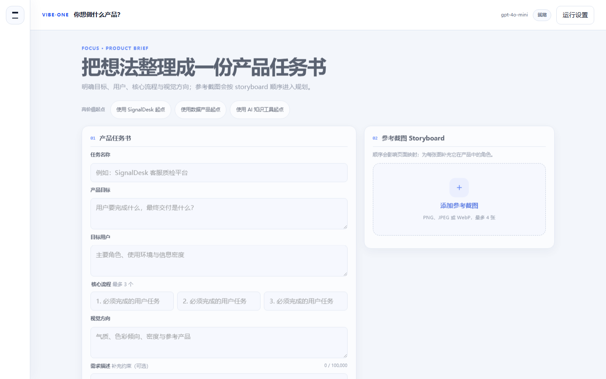
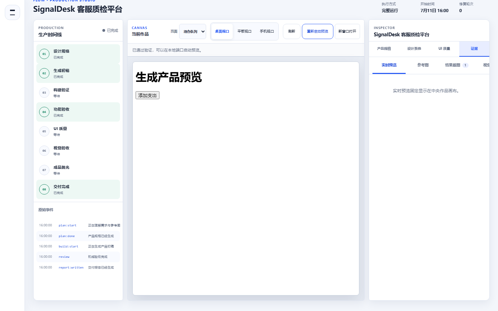

# Vibe-one

[](https://github.com/Aschenbath/Vibe-one/actions/workflows/ci.yml)

Vibe-one 是一条有明确边界的 AI 产品交付流水线：把产品任务书与参考截图转成可运行的 React + Vite 产品，并用本地构建、Playwright 交互、确定性 UI audit、参考图视觉比较和一次有界 polish 决定能否交付。

```text
产品任务书 / 参考图
  -> 产品与设计规格
  -> 初稿生成
  -> 构建 + 内容 + 交互 + UI audit
  -> 视觉门禁（有参考图时）
  -> 有界修复至首次全绿
  -> 单次 polish candidate + 全量复验
  -> 不可变证据 + Delivery Report
```

## 为什么做 Vibe-one

大模型可以快速写出页面，但“代码生成完成”不等于“产品可交付”。作品集真正需要证明的是：需求如何变成可执行规格，失败如何被本地证据发现，修复如何受边界约束，最终结果为什么值得相信。

Vibe-one 因此坚持三条原则：

1. **模型负责生成，本地规则负责判定。** 模型不能给自己打分。
2. **所有循环有上限。** 文件数、输出字符、修复轮次、polish 文件和图片输入都受硬限制。
3. **每个结论有证据。** 规格、命令、截图、UI audit、视觉分数、修复与最终报告都可回放。

## Product Studio

浏览器工作台分为 `Focus -> Flow`：

- **Focus 产品任务书**：产品目标、目标用户、最多三个核心流程、视觉方向、补充约束和有序参考图 storyboard。
- **Flow 生产时间线**：设计规格、初稿、构建、功能验收、UI 质量、视觉验收、成品抛光和交付。
- **作品画布**：保留最近一次可用预览，可切换页面与桌面/平板/手机视口，不重新启动任务。
- **Quality Inspector**：集中查看产品规格、design tokens、UI failures、视觉比较、polish 和 Delivery Report。
- **窄屏查看**：画布保持主内容，时间线与 Inspector 变为互斥抽屉；可见交互目标至少 44px。

```bash
npm run console
```

| Focus 产品任务书 | Flow 作品画布与 Inspector |
| --- | --- |
|  |  |

工作台默认只监听 loopback。浏览器填写的 API Key 仅保留在当前 Node.js 进程内；公开任务对象和持久化证据不包含 Key、上传 base64、私有 endpoint 或绝对路径。

## 成品质量流水线

| 阶段 | 本地成功条件 |
| --- | --- |
| Planner | `productDesign`、页面、场景、acceptance criteria 和参考图映射全部通过 schema 校验 |
| Builder | 最多 12 个模型文件、约 24,000 字符；固定脚手架与依赖白名单 |
| Functional review | build 成功、页面文本存在、Playwright 场景全部通过 |
| UI quality audit | 桌面/移动无横向溢出；44px 目标；WCAG AA；语义层级、内容与状态完整 |
| Visual gate | 有参考图时执行本地结构分 + RGB 颜色分，默认阈值 `0.62` |
| Repair | 只根据失败证据做有界完整文件修复，轮次耗尽即失败 |
| Polish | 首次全绿后在隔离候选中最多修改 4 个文件 / 18,000 字符；全量复验后才提升 |
| Delivery | 发布不可变 evidence bundle 与中英双语 `DELIVERY_REPORT.md` |

UI audit 证明的是可复现的完成度，不假装判断“审美”；视觉分数证明的是粗粒度结构与颜色相似度，不代表像素级复刻；最终作品截图仍需人工审查。

## 主演示：SignalDesk

SignalDesk 是纯文字输入的 AI 客服质检与运营平台，用于证明没有参考图时也必须通过成品质量门禁。

- 3 个页面：运营总览、会话队列、质检详情。
- 6 个交互：风险筛选、搜索、清空筛选、打开详情、分配负责人、标记复核并返回。
- 数据内容：SLA、满意度、风险会话、渠道、团队负载、规则命中、评分拆解和证据。
- 输入：[examples/signaldesk/input/brief.md](examples/signaldesk/input/brief.md)

真实 API 证据将在成功运行后写入 `docs/demo-reports/signaldesk.md` 与 `docs/screenshots/signaldesk-*`。当前输入与离线契约已完成；最近一次真实尝试因上游连续 HTTP 503 在 planner 阶段安全失败，没有伪造主演示产物。

## 主演示：Atlas Research

Atlas Research 是任务书 + 两张参考图的研究情报工作台，用于证明多模态页面映射、视觉门禁和证据修复链路。

- 3 个页面：资料库、双栏阅读工作区、洞察集合。
- 6 个交互：搜索资料、打开阅读、切换引用、保存洞察、筛选集合、收藏并返回。
- 参考图进入 planner mapping、视觉比较和 repair evidence，而不是只展示在 UI 中。
- 输入：[examples/atlas-research/input/brief.md](examples/atlas-research/input/brief.md)

真实 API 证据将在成功运行后写入 `docs/demo-reports/atlas-research.md` 与 `docs/screenshots/atlas-*`。当前输入与两张公开安全参考图已通过本地 magic-byte、尺寸和路径 jail 校验；最近一次真实尝试同样被上游 HTTP 503 阻断在 planner。

历史上的记账与笔记真实演示仍保留用于回归和 repair 案例，但不再作为主能力证明，见 [演示归档](docs/demos/archive.md)。

## 安全边界

- 固定 `package.json` / Vite 配置；模型不能写 manifest、lockfile、npmrc 或配置文件。
- 依赖固定白名单；安装使用 `npm install --ignore-scripts`。
- 所有模型路径经过 `safeJoin`；拒绝绝对路径、遍历、链接和越界 evidence。
- PNG/JPEG/WebP 最多 4 张，单张 6 MiB、总计 18 MiB；console 请求体最多 26 MiB。
- Provider 对网络错误、429 和 500/502/503/504 做有界退避；耗尽后写安全失败报告。
- 当前只生成响应式 React + Vite Web 产品；不包含远程托管、认证、多用户、并发任务或持久化凭证。

## 快速开始

```bash
npm install
npx playwright install chromium
npm test
npm run test:console:e2e
```

配置一个 OpenAI-compatible endpoint：

```powershell
$env:VIBE_ONE_API_KEY = 'your-key'
$env:VIBE_ONE_BASE_URL = 'https://your-openai-compatible-endpoint/v1'
$env:VIBE_ONE_MODEL = 'your-model-id'
```

```bash
npm run demo:signaldesk
npm run demo:atlas
node src/cli/index.js plan examples/signaldesk
```

完整无 API 集成测试会执行真实 npm install/build、Vite preview、Playwright 截图、UI repair、视觉 repair 和 polish：

```bash
VIBE_ONE_E2E=1 npm test
```

## 运行产物

每次运行写入 `runs/<target>-<timestamp>/`：

| 产物 | 含义 |
| --- | --- |
| `SPEC.generated.md` / `PLAN.generated.md` | 产品设计、页面、场景与验证计划 |
| `app/` / `draft/` / `polish-candidate/` | 最终应用、首次全绿初稿和隔离 polish 候选 |
| `screenshots/` / `quality/` / `visual/` / `polish/` | 各阶段不可变图片与结构化结果 |
| `logs/events.jsonl` | 持久化阶段事件 |
| `DELIVERY_REPORT.md` | 双语命令、用量、失败、修复、质量与最终状态 |

产品边界见 [FRAMEWORK.md](FRAMEWORK.md)，模块设计见 [docs/architecture.md](docs/architecture.md)，当前交接见 [docs/HANDOFF.md](docs/HANDOFF.md)。

## English Overview

Vibe-one is a bounded AI product-delivery pipeline, not a collection of manually authored demo apps. It converts a structured brief and optional screenshots into an executable React + Vite product, then uses deterministic local evidence to decide whether the result can ship.

Key evidence:

- Product Studio with a Focus brief canvas, production timeline, persistent preview canvas, and quality Inspector.
- Schema-validated product design, bounded 12-file builder output, desktop/mobile UI audit, and optional local visual comparison.
- One isolated polish candidate promoted only after build, content, interaction, UI, and visual re-verification.
- Fixed scaffolding, dependency allowlist, path jail, secret-safe public APIs, immutable evidence bundles, and bounded retries.
- Representative inputs: text-only SignalDesk and multimodal Atlas Research. Real showcase artifacts are published only after successful API runs and human screenshot review.
