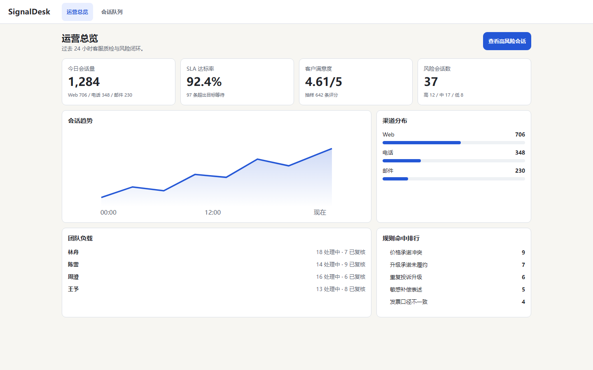
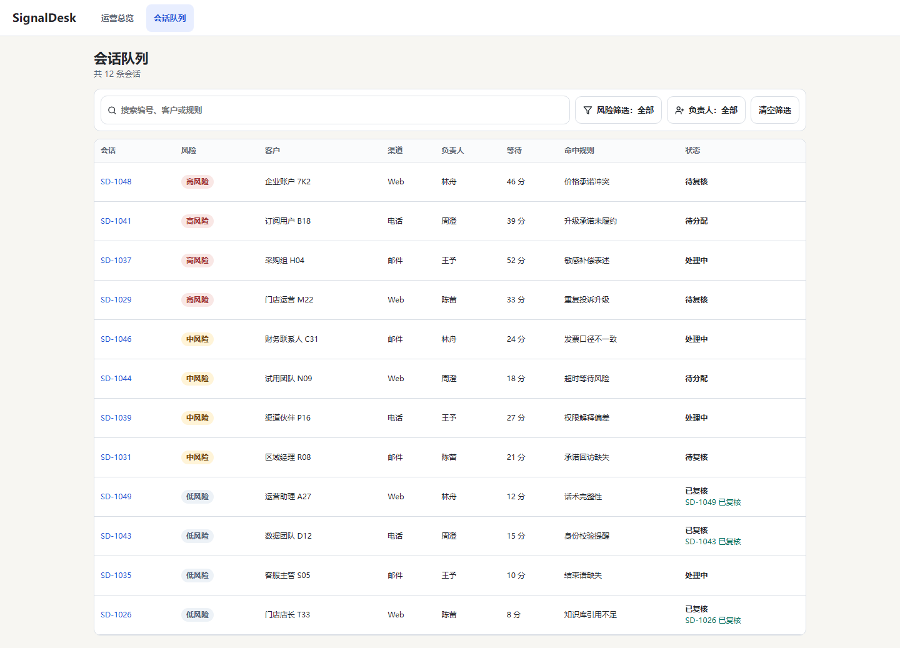
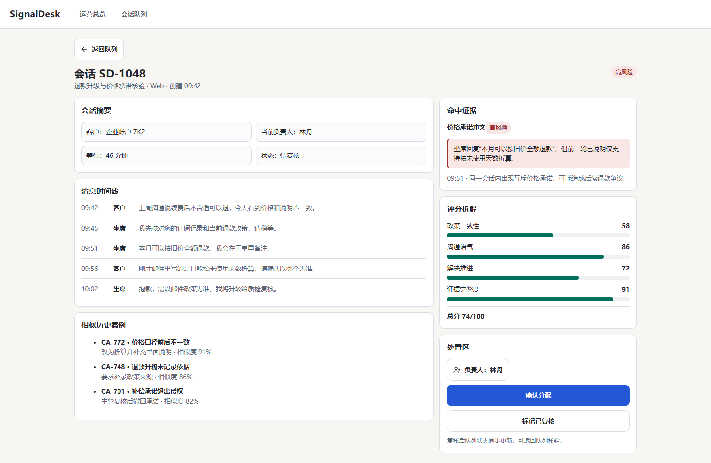
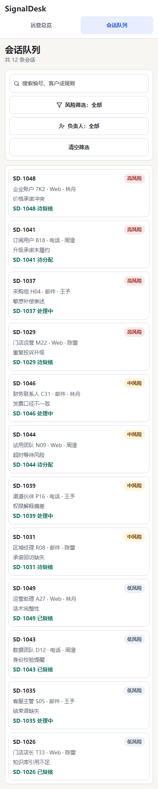
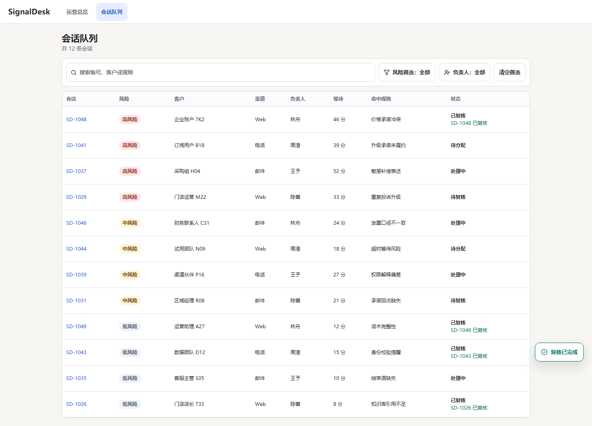
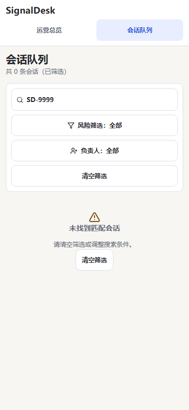

# SignalDesk：AI 生成之后，程序自动验收

SignalDesk 是一个客服质检后台，也是 Frontend Autopilot 目前最完整的一次真实生成案例。

我没有先手写页面再让工具“演示生成”。
输入只有一份产品需求：做一个包含运营总览、风险会话队列和质检详情的前端，让主管能找到高风险会话、查看证据、分配负责人并完成复核。

## 最终做出了什么

| 运营总览 | 会话队列 | 质检详情 |
| --- | --- | --- |
|  |  |  |

生成结果包含 3 个页面，使用一致的模拟数据串起完整流程。它不是只能浏览的静态稿：筛选和搜索会改变列表，点击会话能进入详情，负责人可以修改，完成复核后回到队列还能看到更新后的状态。

## 我没有用截图证明“功能完成”

Frontend Autopilot 在浏览器里实际执行了 6 个场景：

1. 从运营总览进入高风险会话队列；
2. 搜索“退款升级”并找到 `SD-1048`；
3. 切换风险筛选，再恢复完整队列；
4. 打开 `SD-1048`，查看“价格承诺冲突”证据；
5. 把负责人分配给陈蕾；
6. 标记为已复核，返回队列确认状态仍然存在。

最终 6/6 场景通过，安装、生产构建、页面内容和其他交付检查合计 28/28 通过。

| 手机端队列 | 完成复核后的结果 | 手机端空状态 |
| --- | --- | --- |
|  |  |  |

## 第一版其实没有通过

第一版功能流程基本可用，但 UI 检查发现两个实际问题：部分点击区域小于 44px，一些状态文字的对比度不足。

系统没有重新生成整个项目，也没有让模型笼统地“优化 UI”。它把具体失败项交给 Fixer，并限制修复范围。Fixer 只修改了 `src/styles.css`。随后整个应用重新经历构建、6 个交互场景、桌面/手机 UI 和四种状态检查，全部通过。

这次过程最能说明 Frontend Autopilot 的价值：**生成并不是结束，发现问题、控制修改范围、证明没有改坏，才是交付。**

## 四种页面状态也真的跑过

loading、empty、error、success 不只是写在需求或 DOM 里的隐藏文字。每个状态都有自己的页面地址、触发步骤和预期结果，Playwright 会分别在桌面和手机尺寸执行并检查。

这避免了一个常见的“假验收”：只要源码里出现过 `loading` 字样，就声称加载状态已经实现。

## 这次结果能证明什么

- 文字需求可以被整理成可执行的页面和交互验收；
- 模型生成的 React 应用可以在固定安全边界内真实构建；
- 浏览器操作能发现仅看源码或首页截图发现不了的问题；
- 自动修复可以有明确范围和停止条件；
- 修复后的版本可以通过完整复验再交付。

## 它不能证明什么

SignalDesk 使用的是模拟数据，没有真实后端、登录、权限或多人协作。UI 检查能发现布局和可访问性问题，但不能证明设计一定符合所有人的审美。这是一个经过验证的前端生成案例，不是可以直接上线的客服系统。

## 原始证据

- [输入的产品需求](../examples/signaldesk/input/brief.md)
- [机器生成的完整 Delivery Report](demo-reports/signaldesk.md)
- 最终记录：3 pages、6/6 scenarios、28/28 checks、1 repair round

## English summary

SignalDesk was generated from a text brief rather than hand-authored as a demo. The first version failed measurable UI checks, received one evidence-scoped CSS repair, and then passed the complete build, 6/6 Playwright scenarios, 28/28 delivery checks, responsive UI audit, and executable state verification. It demonstrates bounded frontend delivery—not a production backend or human-level design judgment.
